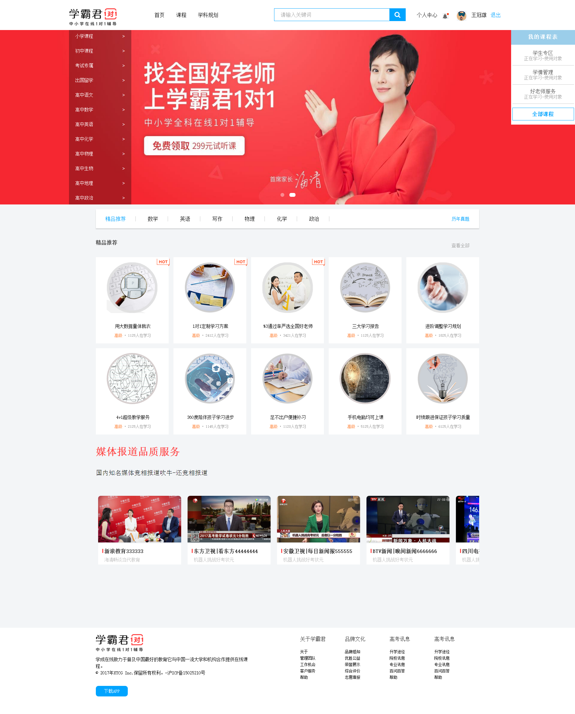

# **StudyingOnline**
-------
## 项目介绍 ：学霸君1对1，是国内领先的在线一对一辅导品牌，基于学霸君9000万用户、100亿次搜题数据、  
600万次老师在线答疑、学生课堂反馈数据，精准分析学生的知识点掌握情况，构建知识体系。  
帮助孩子迅速提升成绩，找到有效的学习方法的目的  
----------
## 项目链接 ：  
------
## 项目职责 ：使用H5C3快速构建项目静态页面，并且使用JS的动态操作和良好的动画很好的加添页面的交互效果  
------
## 实现技术 ：HTML/CSS/H5C3/JQuery/Bootstrap.js/JQuery.ui  
-----
## 项目难点 ：1、解决各浏览器的兼容性 2、跨域请求时，修复bug出现内容累加、出现多次请求、收缩下拉框不自动收回、  
内容不随删除而去返回前一次收索内容)   
3、减少多次无用的请求降低高耗能(如多余的照片，多次发送请求等等); 4、差点愁死我的轮播图路径  5、animation中的暂  
停和播放愁死我了--搞了一个多小时原来JS中这样写$('.carousel')[0].style.animationPlayState="paused";非常特殊，悲哀的历程；  
6、最痛苦的第6处，，是做底部循环滚动-直接获取$('目标元素').offset().left; 是悲剧，因为它是距离浏览器  
的边距是正的，这样直接使用回合后来便宜过去的负值产生抵消，使其结果几乎少了一个图片的宽度，所以先获取  
到的偏移值减去它里浏览器的距离值，这样就可以正常做逻辑计算了-（搞了快一天，差点吐血）;  
7、丢人之处7是忘记了offset().left是只读属性，不能设置，外加确实是浏览器抽风，所以硬是耗了一天------我  
真是太难了--不容易  
8、完成了页面登录退出的循环交互  
9、在做轮播图左侧的收缩栏显示隐藏时，要根据实际展示的方式和多少定合适的布局--否则会浪费时间搞逻辑和布  
局的款式和动画的策略--期间更清楚了display的none和block实质就是opacity的变化--动画出现次序上的排序次序  
要摆放在哪里才能实现---也更清楚它们的获取使用console.log($(this)[0]); console.log($(item)[0]); 这是获  
取每一项  
	`console.log($(this).attr('i'));   获取每一项的索引属性*/`
    `var j = $(this).attr('i');`
	`console.log('所在位置的索引'+j);`
	`console.log($(this).height()*j);`
	`console.log((j*($(this).height())+4));/*'鼠标所在位置的总高度'+*/` 
10、也许还有未来道路很多的未知问题-但我热爱这行-所以也喜欢它的规矩了     
-----
## 解决方案 ：1、加增了兼容的css工具包html5shiv.js/respond.js等 2、使用jQuery的便利寻找跨域的链接，不  
太好找; 合适位置清理拼接好的字符串; 用条件控制收索下拉框的隐藏出现; 防止后续执行使用return返回; 3、使用  
定时器展开收索决定，从而减少高耗能; 使用条件控制照片的加载;    
4、数组中只写image下的路径，并且用img的src = 一个不带引号的路径 (如果光用父盒子的背景做轮播图是出不来的，  
总是被强制删除-后来出来了-其它N种动态方法都会)   
5、注意JS获取偏移的距离这样写 $(this).offset().left;就可以不要多带括号和便宜连这写，否则怀疑人生怀疑智商；  
6 和7 的解答都写到了困难里了    
-----
## 感受：1、做一个项目难处是要把技术点全部记住，屡清楚做项目的思路。  
##		 2、熟悉常用的W3C的规范和标签、样式、让其熟练的在项目中展示，最好可以孰能生巧，并且解决各兼容  
		 问题  
##		 3、记住JS的常用文档API ，并且要明白DOM、BOM的用处和渲染及一些列的操作，还有一些交互效果，还有  
		 高级的用法，会封装功能组件，模块的调用，也就是面向对象  
##		 4、关于JS的一些衍生框架（Vue.JS / React/JS）和组件（Bootstrap.JS / JQuery.JS）,最后还有Node.JS  
##		 5、还有各框架所用的一些组件Element.UI / JQuery.UI / Mint.UI / MUI / Amazing.UI ...  
##		 6、移动端有响应式开发 或 混合开发 （从平台搭建到最后打包上线应该有熟练的操作认识）  
##		 7、关于一些打包工具Webpack / Gulp ，还有一些的项目保存软件Git与GitHub 或是 常用的SVN的 操作  
##		 8、对于制图工具Canvas / Echart.js / Three.js 等也要会用  
##		 9、对于WeChat也要会做项目熟练其内部API及一些时间等  
##		 10、对齐项目工程化也要了解，这样会提高收索引擎的优化（SEO）   

  

